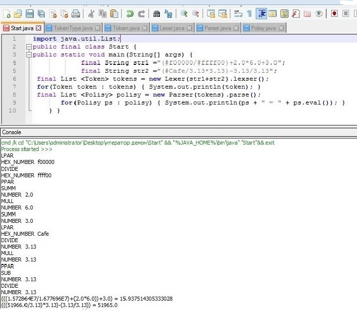
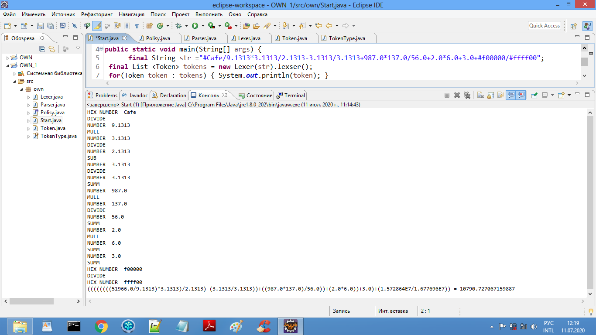

# Калькулятор cmd .

✦  Мы рассмотрим  простую программу,

✦  которая состоит из  калькулятора .

✦ запускаем  её в среде  Eclipse . 

✦ альтернативная среда NetBeans .

✦ работает она как видите в notepad++ если вы установили в него плагин NppExec .

✦       		 

✦ Some  text-->  ▓▓▓▓▓▓▓▓▓▓▓▓▓▓░ 90%  

✦
